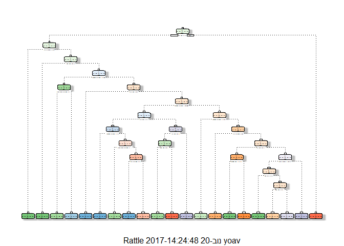

# Machine learning - Prediction Assignment
Yoav Pridor  
19 בנובמבר 2017  


```r
knitr::opts_chunk$set(echo = TRUE)
```

## Executive summary

### Introduction

Using devices such as Jawbone Up, Nike FuelBand, and Fitbit it is now possible to collect a large amount of data about personal activity relatively inexpensively. These type of devices are part of the quantified self movement - a group of enthusiasts who take measurements about themselves regularly to improve their health, to find patterns in their behavior, or because they are tech geeks. One thing that people regularly do is quantify how much of a particular activity they do, but they rarely quantify how well they do it. In this project, your goal will be to use data from accelerometers on the belt, forearm, arm, and dumbell of 6 participants. They were asked to perform barbell lifts correctly and incorrectly in 5 different ways. More information is available from the website here: http://groupware.les.inf.puc-rio.br/har (see the section on the Weight Lifting Exercise Dataset).

### Goal

The goal of this project is to predict the manner in which they did the exercise. 

### Bottom line

The chosen method for classification was Random forest, with an OSE of 0.65%.

## Data preparation


```r
library(caret)
library(rpart)
library(rpart.plot)
library(RColorBrewer)
library(rattle)
library(randomForest)
library(knitr)
library(dplyr)
```


### Downloading
Downlowding and prepairing the training set and the test set:


```r
training <- read.csv(url("http://d396qusza40orc.cloudfront.net/predmachlearn/pml-training.csv"), na.strings=c("NA","#DIV/0!",""))
testing <- read.csv(url("http://d396qusza40orc.cloudfront.net/predmachlearn/pml-testing.csv") , na.strings=c("NA","#DIV/0!",""))
```

###Partitioning


```r
inTrain <- createDataPartition(training$classe, p=0.6, list=FALSE)
Training_part <- training[inTrain, ]
Testing_part <- training[-inTrain, ]
dim(Training_part); dim(Testing_part)
```

```
## [1] 11776   160
```

```
## [1] 7846  160
```

### Subsetting


Subsetting to exclude variables which are only measured for new windows (these variables have mostly "NA" values) and also name and timestamp variables:


```r
Training_part1 <- Training_part[,-c(1:7,grep("^kurtosis", names( training )),grep("^skewness", names( training )),grep("^max_", names( training )),grep("^min_", names( training )),grep("^amplitude", names( training )),grep("^var_", names( training )),grep("^avg_", names( training )),grep("^stddev", names( training )))]
Testing_part1 <- Testing_part[,-c(1:7,grep("^kurtosis", names( training )),grep("^skewness", names( training )),grep("^max_", names( training )),grep("^min_", names( training )),grep("^amplitude", names( training )),grep("^var_", names( training )),grep("^avg_", names( training )),grep("^stddev", names( training )))]
dim(Training_part1); dim(Testing_part1)
```

```
## [1] 11776    53
```

```
## [1] 7846   53
```

Applying the same transformations to the columns of testing set:


```r
new_col <- colnames(Training_part1[, -53])
testing1 <- testing[,new_col]
dim(testing1)
```

```
## [1] 20 52
```

## Cross validation 


```r
set.seed(2308)
```


### Testing Random forest model


```r
model_rf <- randomForest(classe ~ ., data=Training_part1)
pred_rf <- predict(model_rf, Testing_part1, type = "class")
cm_rf <- confusionMatrix(pred_rf, Testing_part1$classe)
cm_rf
```

```
## Confusion Matrix and Statistics
## 
##           Reference
## Prediction    A    B    C    D    E
##          A 2229    5    0    0    0
##          B    2 1509    7    0    0
##          C    0    4 1360   15    0
##          D    0    0    1 1270    6
##          E    1    0    0    1 1436
## 
## Overall Statistics
##                                           
##                Accuracy : 0.9946          
##                  95% CI : (0.9928, 0.9961)
##     No Information Rate : 0.2845          
##     P-Value [Acc > NIR] : < 2.2e-16       
##                                           
##                   Kappa : 0.9932          
##  Mcnemar's Test P-Value : NA              
## 
## Statistics by Class:
## 
##                      Class: A Class: B Class: C Class: D Class: E
## Sensitivity            0.9987   0.9941   0.9942   0.9876   0.9958
## Specificity            0.9991   0.9986   0.9971   0.9989   0.9997
## Pos Pred Value         0.9978   0.9941   0.9862   0.9945   0.9986
## Neg Pred Value         0.9995   0.9986   0.9988   0.9976   0.9991
## Prevalence             0.2845   0.1935   0.1744   0.1639   0.1838
## Detection Rate         0.2841   0.1923   0.1733   0.1619   0.1830
## Detection Prevalence   0.2847   0.1935   0.1758   0.1628   0.1833
## Balanced Accuracy      0.9989   0.9963   0.9956   0.9932   0.9978
```

The model accuracy is: 0.9935

### Testing decission tree model

```r
model_tree <- rpart(classe ~ ., data=Training_part1, method="class")
fancyRpartPlot(model_tree)
```

<!-- -->


```r
pred_tree <- predict(model_tree, Testing_part1, type = "class")
cm_tree <- confusionMatrix(pred_tree, Testing_part1$classe)
cm_tree
```

```
## Confusion Matrix and Statistics
## 
##           Reference
## Prediction    A    B    C    D    E
##          A 2008  272   84  105   67
##          B   61  842   72   35   32
##          C   86  202  915  114  149
##          D   42   73  260  881  154
##          E   35  129   37  151 1040
## 
## Overall Statistics
##                                           
##                Accuracy : 0.7247          
##                  95% CI : (0.7147, 0.7346)
##     No Information Rate : 0.2845          
##     P-Value [Acc > NIR] : < 2.2e-16       
##                                           
##                   Kappa : 0.6505          
##  Mcnemar's Test P-Value : < 2.2e-16       
## 
## Statistics by Class:
## 
##                      Class: A Class: B Class: C Class: D Class: E
## Sensitivity            0.8996   0.5547   0.6689   0.6851   0.7212
## Specificity            0.9059   0.9684   0.9149   0.9194   0.9450
## Pos Pred Value         0.7918   0.8081   0.6241   0.6248   0.7471
## Neg Pred Value         0.9578   0.9006   0.9290   0.9371   0.9377
## Prevalence             0.2845   0.1935   0.1744   0.1639   0.1838
## Detection Rate         0.2559   0.1073   0.1166   0.1123   0.1326
## Detection Prevalence   0.3232   0.1328   0.1868   0.1797   0.1774
## Balanced Accuracy      0.9028   0.7615   0.7919   0.8022   0.8331
```

The model accuracy is: 0.7536


### Model selection

From the 2 methonds tested the Random Tree method produces the highest Accuracy level. 

Prediction on the test set will be caried out using the Random forest model.

### Expected out of sample error

The expected out of sample error for this prediction is: 
E(ose) = 100-%Accuracy = 100 - 99.35 = 0.65%

## Prediction for the quiz test set (validation)


```r
pred_val <- predict(model_rf, testing1, type = "class")
pred_val
```

```
##  1  2  3  4  5  6  7  8  9 10 11 12 13 14 15 16 17 18 19 20 
##  B  A  B  A  A  E  D  B  A  A  B  C  B  A  E  E  A  B  B  B 
## Levels: A B C D E
```


